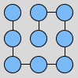

# Maze Generator

This is a small side project I did for fun. I was wondering about how graph theory is applied to mazes, and started tinkering with some of the basic graph concepts and algorithms. I made it with **React** and plain CSS to add a bit of style.

## How the mazes are generated

I wrote the algorithm before I looked at the theory behind mazes, so I might have taken an unconventional approach. The idea is to first generate a fully connected graph, where each vertex represents a tile in the final maze. They are fully connected because the algorithm will then start removing edges one by one until no more are available. So, it starts looking like:

Which translates into a maze that looks like:

This is because edges in the graph represent connections between tiles, or to put it differently, the lack of an edge represents a wall in the maze. So if we proceed to remove some edges, the graph and maze would change accordingly:
 

The algorithm creates a list of available edges to remove (which initially contains all edges) and does the following in each step until there are no more available edges:

- Removes a random edge from the graph

- Runs a **Breadth First Search** (BFS) in order to determine if the graph is bipartite
	- If the graph is bipartite after removing the last edge, undo the removal (because mazes cannot be bipartite)
	
- Updates the array of available edges by deleting the edge we just attempted to remove

After this, we end up with a **Perfect Maze**. This is because of two properties:

- The graph is connected, which means there is always a way to traverse from any point `A` to any point `B`. This is true because we do not allow the removal of edges that would make the graph bipartite.

- The graph has no loops, which means that there is only exactly one way to traverse from any point `A` to any point `B` without repeating vertices. This is also true because we don't stop removing edges until there are none available. The existence of a loop would mean that there is at least one edge that still be removed without making the graph bipartite.
