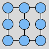
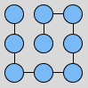

# Maze Generator

This is a small side project I did for fun. I was wondering about how graph theory is applied to mazes, and started tinkering with some of the basic graph concepts and algorithms. I made it with **React** and plain CSS to add a bit of style.

## How the mazes are generated
I wrote the following two algorithms before I looked at the theory behind mazes, so I might have taken an unconventional (and suboptimal) approach. In both idea is to first generate a fully connected graph, where each vertex represents a tile in the final maze. They are fully connected because the algorithm will then start removing edges one by one until no more are available. So, it starts looking like the image to the right, which translates to a maze that looks like the image to the left:

 

This is because edges in the graph represent connections between tiles, or to put it differently, the lack of an edge represents a wall in the maze. So if we proceed to remove some edges, the graph and maze would change accordingly:

 

### Selecting Random Edges
This algorithm creates a list of available edges to remove (which initially contains all edges) and does the following in each step until there are no more available edges:

- Removes a random edge from the graph

- Runs a **Breadth First Search** (BFS) in order to determine if the graph is bipartite
	- If the graph is bipartite after removing the last edge, undo the removal (because mazes cannot be bipartite)
	
- Updates the array of available edges by deleting the edge we just attempted to remove

After this, we end up with a **Perfect Maze**. This is because of two properties:

- The graph is connected, which means there is always a way to traverse from any point `A` to any point `B`. This is true because we do not allow the removal of edges that would make the graph bipartite.

- The graph has no loops, which means that there is only exactly one way to traverse from any point `A` to any point `B` without repeating vertices. This is also true because we don't stop removing edges until there are none available. The existence of a loop would mean that there is at least one edge that still be removed without making the graph bipartite.

### Selecting edges from vertices with highest degree
I wrote this algorithm because I noticed that my [first algorithm](#selecting-random-edges) was generating mazes with some tiles having connections to their four adjacent vertices (right, down, left and up). I wanted to avoid this because it seemed to me that it made mazes easier to solve. As a solution to this, I came up with the following solution:

- Calculate the degree of each vertex

- Make a list of each degree (1, 2, 3 and 4) and add the vertices with degree `X` to list `X`. This lists contain copies of each vertex.

- Assign a value of highest degree. This will always be `4`` since at least one vertex will be connected to all four adjacent vertices.

- While there are vertices with available edges:
	- Pick a random vertex from the list of highest degree

	- Pick a random edge from this vertex

	- Remove the edge and check if this makes the graph bipartite
		- If it does make the graph bipartite, undo the removal of the edge
		
	- Remove the edge from the vertex in the degree list.
		- If this makes the list of edges in the vertex empty, remove the vertex from the degree list.
			- If this makes the degree list empty, remove the degree list and decrease the highest degree value.
	
After this, we end up with a perfect maze that has no tiles with 4 connections, because all of the vertices of degree 4 will always be selected first for edge removal.